# ❓ Como Organizar Bases de Dados no Excel
## 💡 Dicas para quem está iniciando no mundo da Análise de Dados

Já se sentiu perdido com planilhas cheias de dados dispersos e confusos?

Organizar bases de dados no Excel pode parecer complicado no início, mas com a ajuda das ferramentas certas é possível descomplicar e fluir com naturalidade. Tudo começa aqui!

Neste artigo, apresentamos dois tópicos muito importantes na hora de organizar seus dados:

- Dados Desestruturados x Estruturados
- ETL (do inglês: Extract, Transform e Load) no Power Query - Trazendo para PT-BR: Extração, Transformação e Carregamento.

### 📊 Dados Desestruturados ❌ Dados Estruturados

#### Dados Desestruturados:
Dados desestruturados não seguem um padrão específico para o registro dos dados o que torna sua análise e compreensão num verdadeiro desafio.

A primeira vista pode até parecer rico em dados por conter muitas informações as vezes até com um certo detalhamento, mas é muito mais difícil de extrair alguma análise no meio da "bagunça".

Uma das principais características dos dados desestruturados é o que chamamos de 'crescer para o lado'. Se isso acontece com sua base de dados, é sinal de que você está no caminho certo ao ler este artigo buscando compreender os princípios básicos da organização de dados no Excel.

Repare na imagem abaixo que para cada mês que precisar ser acrescentado no futuro, será necessário inserir uma nova coluna. Assim crescendo para o lado:
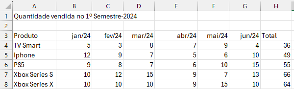

[saiba mais -->](https://www.dataside.com.br/dataside-community/big-data/tipos-de-dados-estruturados-semi-estruturados-e-nao-estruturados)

#### Dados Estruturados:
Dados estruturados seguem uma série de boas práticas que facilitam a organização e análise dos dados. Possuem regras e padrões a serem seguidos no momento de inserção, alteração ou exclusão de registros.

A principal característica dos dados estruturados é ter suas informações no formato de tabela, onde cada coluna representa o 'tipo de informação' e cada linha representa um registro. É uma boa prática nomear os cabeçalhos das colunas de forma a descrever os dados contidos nela.

Seguindo o mesmo exemplo anterior, agora temos:
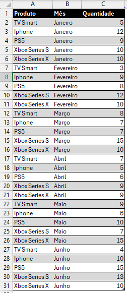

Repare que nesse caso toda vez que for inserido um novo registro, ele virá na linha seguinte a última da tabela, sendo assim a tabela 'cresce para baixo'. Lembre-se disso: crescer para baixo é sempre a melhor escolha.

E aqui não precisamos nem nos importar com a ordem em que os registros sejam inseridos, desde que siga a estrutura e os tipos de dados corretos para cada coluna.

[saiba mais -->](https://www.dataside.com.br/dataside-community/big-data/tipos-de-dados-estruturados-semi-estruturados-e-nao-estruturados)

### ♻ ETL no Power Query
ETL (Extração, Transformação e Carregamento) é um processo essencial para preparar os dados para análise.

No ano de 2013 a Microsoft lançou o Power Query como um suplemento do Excel, podendo ser instalado/utilizado no Excel 2010 e Excel 2013. Em 2016, o Power Query foi incluído no Excel nativamente.

#### E - Extract (Extração)
A primeira etapa do ETL é a 'Extração', ou a obtenção dos dados podendo ser feita de diversas fontes diferentes, tais como: planilhas, arquivos de texto (csv), SQL, ODBC, SAP HANA e etc.

O Power Query nos permite extrair dados de MUITAS fontes diferentes.

##### ✍ Mão na massa
No Excel, vá para:

    Dados - Obter Dados

Escolha entre uma enorme variedade de fontes disponíveis.

Seguiremos com nosso exemplo do Excel. Então selecione:
    
    Dados - Obter Dados - De Arquivo - Do Excel Pasta de Trabalho
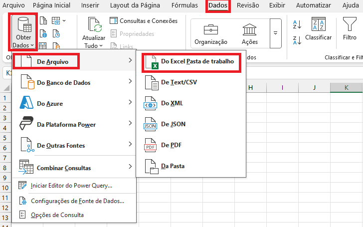

Navegue até a pasta onde sua planilha está salva:

    Selecione o arquivo - Clique em Importar
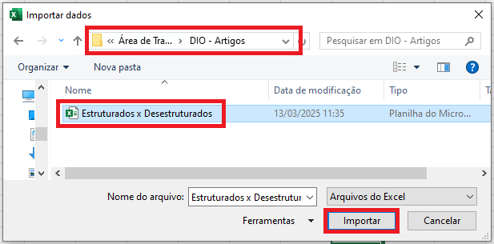

Temos diferentes 'bases de dados' dentro do nosso arquivo, é aqui que selecionamos com qual delas queremos trabalhar. Veja que há diferença entre objetos tabela e as planilhas(abas) do nosso arquivo.
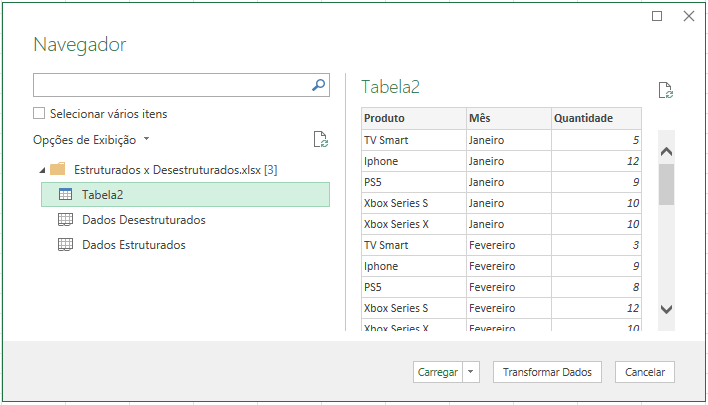

O objeto tabela é apresentado com o ícone de tabela com uma barrinha azul no cabeçalho, já as planilhas apresentam o ícone de planilha com 2 abinhas logo abaixo.

Preferencialmente trabalhamos com objeto tabela, já que a chance dos dados estarem melhor estruturados é bem maior.

Ao selecionar uma base de dados, temos uma pré-visualização da mesma ao lado direito.

Podemos clicar em 'Carregar' para finalizar a etapa de 'Extração' do ETL e apresentar os dados já carregados em uma nova planilha.

Ou, podemos clicar em 'Transformar Dados' para já iniciarmos a próxima etapa do ETL, 'Transformação'.

É uma boa prática sempre selecionarmos a opção 'Transformar Dados'.

#### T - Transform (Transformação)
A transformação envolve a limpeza e a modificação dos dados para que estejam em um formato adequado para nossa análise.

É aqui que deixamos os dados estruturados, facilitando a análise e apresentação de forma clara e objetiva.

O objetivo deste artigo não é nos aprofundarmos no uso da ferramenta Power Query, mas a título de exemplo das diferenças entre Dados Estruturados x Dados Desestruturados, vejamos:

Ao realizarmos a 'Extração' dos Dados Desestruturados:
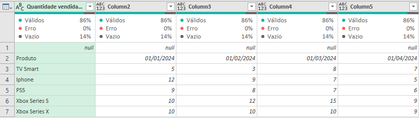

O próprio Power Query teve dificuldades em identificar e organizar as informações, podemos ver que os cabeçalhos das colunas não foram devidamente reconhecidos, existem muitos campos 'null' (vazios) na tabela e as informações estão apresentadas de uma forma um tanto quanto caótica.

Já para a 'Extração' dos Dados Estruturados, temos:
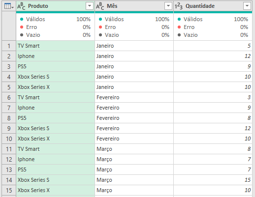

Perceba que o Power Query foi capaz de identificar e organizar as informações de forma muito mais limpa e coesa.

Respeitando o cabeçalho das colunas, os tipos de dados. E agora não temos nenhum campo 'null' (vazio). Só essa primeira transformação já nos deixa numa condição muito melhor de análise dos dados.

#### L - Load (Carregamento)
A última etapa do ETL é a de carregar os dados que transformamos anteriormente de volta para o Excel, onde podemos utilizá-los para criar tabelas dinâmicas, gráficos, dashboards, segmentações e outras análises.

Para tal, basta clicarmos no botão 'Fechar e Carregar' 

[saiba mais -->](https://learn.microsoft.com/pt-br/power-query/power-query-what-is-power-query)

❓ Cansado de passar aperto na hora de analisar dados no Excel?

❓ Já não aguenta mais tantas fórmulas como: SE, SOMASE, ÍNDICE, CORRESP, PROCV, PROCX entre outras?

Conheça o Power Query e aplique as mesmas soluções de forma muito mais fácil e intuitiva com apenas poucos cliques do mouse!

### 📚 Conhecendo um pouco mais do Power Query
O Power Query abre em uma janela a parte do Excel, só é possível voltar a trabalhar na pasta de trabalho do Excel após fechar o editor de consultas do Power Query.
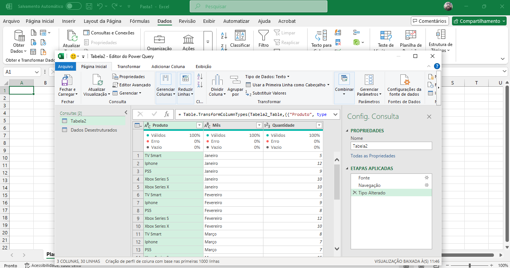

O editor de consultas do Power Query é muito parecido com os aplicativos do Microsoft Office, tornando-o muito intuitivo e familiar mesmo aos usuários inexperientes.

#### Menu - Página Inicial

Contém as principais funcionalidades.

#### Menu - Transformar

Como o nome já diz, aqui encontramos opções para transformar os dados da nossa tabela geralmente utilizada quando não queremos adicionar uma nova coluna.

#### Menu - Adicionar Coluna

As funcionalidades aqui serão aplicadas adicionando uma nova coluna em nossa tabela, com base em dados de outras colunas

#### Menu - Exibição
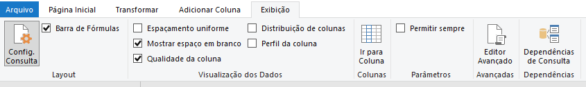
Tal qual no Excel, aqui podemos optar por aquilo que será exibido ou não na janela.

#### Barra de Fórmulas

Muito similar a barra de fórmulas do Excel. Porém aqui não utilizamos fórmulas de Excel, mas sim a linguagem de programação do Power Query chamada [Linguagem M](https://learn.microsoft.com/pt-br/powerquery-m/).

Mas não se preocupe, não é necessário saber nada de Linguagem M para trabalhar com o Power Query inicialmente. Aqui fazemos tudo com simples cliques de mouse e o próprio Power Query cria o código por trás.

Claro que se quiser se destacar ainda mais e fazer transformações ainda mais poderosas em seus dados, sugiro se aprofundar um pouco mais na Linguagem M.

#### Consultas
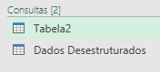

Ao lado esquerdo ficam as consultas (é assim que o Power Query chama os dados que importamos na etapa de Extração do ETL)

Repare que embora tenhamos feito a extração dos dados desestruturados em planilha, aqui o Power Query já nos apresenta como uma tabela.

Que tal renomear nossa consulta 'Tabela2' para um nome mais fácil de entender? Aproveito pra deixar aqui a dica, sempre utilize nomes intuitivos que façam referencia direta aos seus dados, assim fica muito mais fácil aplicar "manutenções" futuras.

Para renomear basta clicarmos com o botão direito do mouse e selecionar a opção 'Renomear'
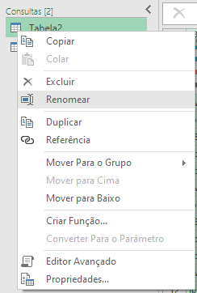

Ficamos assim:

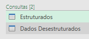

#### Visualização
Mais centralizado na tela, temos a visualização dos dados contidos na consulta selecionada
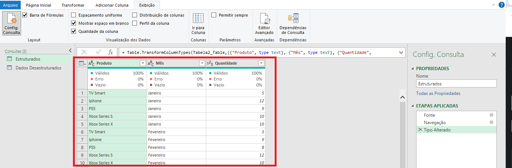

Vale ressaltar que a visualização da 'Qualidade da coluna' deve ser ativada na guia 'Exibir', pois a mesma vem desabilitada por padrão.
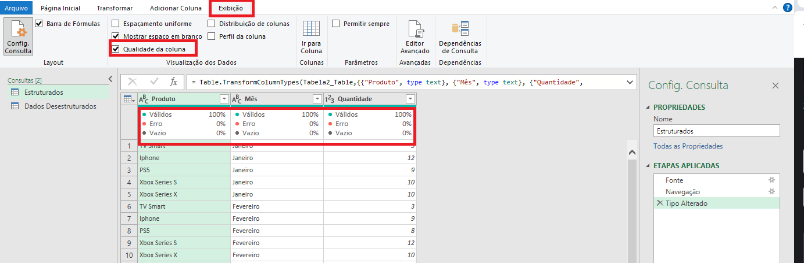

#### Config. Consulta
Ao lado direito da tela, diria que é a parte mais importante do Power Query

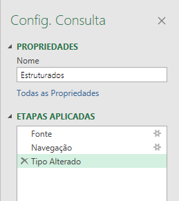

Para começar temos o nome da nossa consulta, também podemos renomear por aqui apenas clicando na caixa de texto e escolhendo o novo nome.

Para ilustrar, ficamos assim:

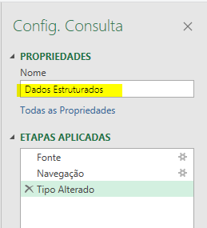

Logo abaixo do nome da nossa consulta, temos as 'Etapas Aplicadas'. É aqui que a mágica acontece.

Em 'Etapas Aplicadas' como o próprio nome sugere, é o local onde o Power Query registra cada ação que fazemos em nossa base de dados na etapa de 'Transformação' do ETL.

Ao selecionar uma das etapas aplicadas, podemos verificar na barra de fórmulas o código em Linguagem M criado pelo Power Query para aplicar a transformação que aplicamos em nossa consulta como por exemplo renomear uma coluna, ou alterar o tipo de dado.

A Visualização de nossa consulta também corresponde a cada etapa aplicada. Exemplo: Temos 15 etapas aplicadas, ao selecionarmos a 7ª etapa, visualizamos nossa consulta exatamente como ela estava àquela altura. É literalmente uma linha do tempo.

Cada ação corresponde a uma 'Etapa Aplicada'. Mas e se eu fiz alguma alteração por engano e quiser voltar atrás?

CTRL + Z? - Não existe essa opção no Power Query (😲 socorro Deus kkk). Calma não se desespere...

Vamos as opções:

- Podemos excluir uma etapa aplicada, simplesmente clicando no X ao lado esquerdo dela, assim retornamos nossa consulta ao estado anterior (igualzinho ao CTRL + Z)
- Podemos alterar a etapa aplicada, clicando na engrenagem ao lado direito dela
- Podemos alterar diretamente na barra de fórmulas (aqui seria necessário um pouco mais de entendimento da Linguagem M)

#### Rodapé
Por fim temos o rodapé que nos apresenta algumas informações sobre a consulta em que estamos trabalhando no momento.

A visualização do Power Query apresenta no máximo 1000 (mil) linhas, mas sua base pode conter muito mais. O limite de linhas estará relacionado à outra ferramenta na qual você irá carregar os dados.

❗ Por exemplo:

- Excel - O limite do Excel é de 1.048.576 (um milhão, quarenta e oito mil e quinhentas e setenta e seis) linhas. 16.384 (dezesseis mil, trezentas e oitenta e quatro) colunas
- Power BI - 2.147.483.647 (+ de 2 Bilhões) de linhas e 16.000 (dezesseis mil) colunas

Claro que o poder de processamento de bases de dados gigantes vão depender de outros fatores como:, capacidade de processamento do próprio computador, memória etc.

Quer saber de um "segredinho" muito interessante? - Todas as modificações/transformações que fazemos nas consultas do Power Query, NÃO ALTERAM a base de dados original. É isso mesmo, aquela nossa planilha original com dados estruturados e dados desestruturados permanece exatamente igual, não é fantástico?

E tem mais: uma vez que fizemos todo o tratamento dos nossos dados no Power Query, não precisamos nos preocupar e refazer caso haja alterações na base de dados original.

Por exemplo: Digamos que as quantidades de vendas do mês de julho-2024 foram acrescentadas na base de dados original, no Power Query basta clicarmos no botão 'Atualizar Visualização' que ele irá aplicar todas as etapas já criadas e apresentará os novos dados.

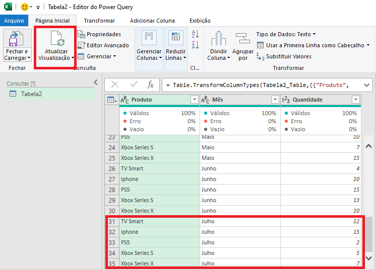

#### ✅ CONCLUSÃO
Compreender a diferença entre dados estruturados e desestruturados e utilizar o processo de ETL no Power Query são passos fundamentais para Organizar Bases de Dados no Excel. Com essas ferramentas, você pode transformar suas planilhas em poderosos instrumentos de tomada de decisão. Experimente essas técnicas e veja como elas podem facilitar seu trabalho com dados!

Adquirir essa Skill de Organizar Dados no Excel é o primeiro passo para uma carreira de sucesso em Análise de Dados. Esse é um conhecimento que irá te acompanhar em toda sua jornada, mesmo quando estiver aprendendo e/ou trabalhando com ferramentas mais robustas e modernas como: Power Query, Power BI, Python e etc. Você verá que tudo começa com o bom e velho ETL.

Que tal aplicar esse conceito já nos seus primeiros projetos?

Mostrar domínio do ETL com certeza irá impulsar sua carreira com dados, impressionando e auxiliando gestores nas tomadas de decisão baseadas em dados estruturados.

#### 🔗 Links Úteis
- [DIO - Home](https://web.dio.me/)
- [DIO - Santander - Excel com Inteligência Artificial](https://web.dio.me/track/santander-excel-com-inteligencia-artificial)
- [DIO - Criando Dashboard de Vendas com IA e Excel](https://web.dio.me/lives/criando-dashboards-impressionadores-com-ia-e-excel)
- [DIO - Cursos e Formações em Power BI](https://web.dio.me/play?search=power%20bi)
- [Microsoft - Power Query](https://learn.microsoft.com/pt-br/power-query/power-query-what-is-power-query)
- [Linguagem M](https://learn.microsoft.com/pt-br/powerquery-m/)
- [Data Side](https://www.dataside.com.br/)

\
\
\
\
\
\
Autor: [Paulo Sanches](https://github.com/paulohdsanches?tab=repositories)